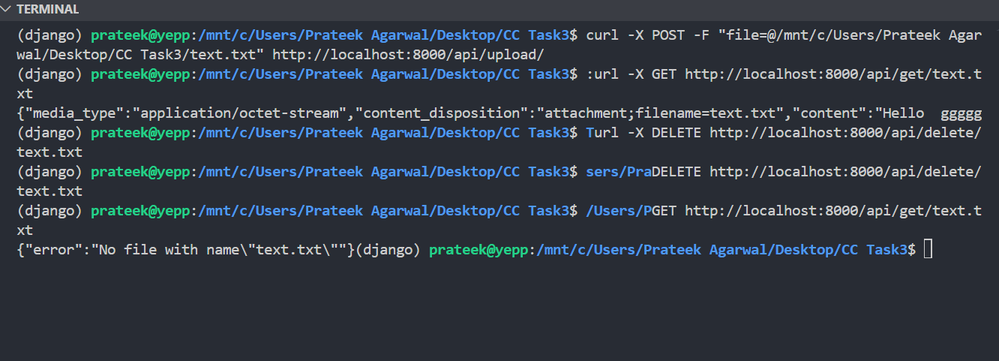

# File Manager API


# Features

This API helps in uploading,retreiving and deleting files on a virtual database running on docker. While retreiving you can read the content of file as well without downloading , on the terminal itself.

# Working and structure

- **Class-Based Views:** Used for handling API endpoints.
- **HTTP Methods:** Implemented POST for file upload,GET for file retrieval,and DELETE for file deletion.


# Screenshot

A screenshot on final working





## Installation
To run locally follow the following steps


```bash
git clone https://github.com/Prateek-Agarwal2006/File_Managing_API
cd File_Managing_API
```
Set up Env 
```bash
python -m venv env
source env/bin/activate  # On Windows use `env\Scripts\activate`
```
Install dependencies
```bash
 pip install -r requirements.txt
```
Set Up Config File as .env and in that
```bash
SECRET_KEY=your_secret_key
```
To generate sectret key bash on terminal and paste it in place of your_secret_key or if that not works directly paste it in place of settings.py
```bash
python -c 'from django.core.management.utils import get_random_secret_key; print(get_random_secret_key())'

```
Set up database on Docker
```bash
#Make sure docker is installed and set up on your device

```
```bash
docker pull postgres:latest

```
```bash
docker run --name my-postgres -e POSTGRES_PASSWORD=password -d -p 5432:5432 postgres       #you can change password according to you

```
Now send init.sql to running container
```bash
docker cp init.sql my-postgres:/docker-entrypoint-initdb.d/

```
Restart the container:
```bash
docker restart my-postgres
```
Finally run on terminal(make sure you dont run python manage.py makemigrations as we only want to interact with database on docker so no need to make more table as that is already done by init.sql)
```bash
#don't forget to change password of Database on your settings.py..you may use .env for that
python manage.py migrate     #(after running it you may be asked to makemigrations but don't do that)
python manage.py runserver

```

Go to another terminal:
For uploading
```bash
curl -X POST -F "file=@/path to your file" http://localhost:8000/api/upload/
For example:
curl -X POST -F "file=@/mnt/c/Users/Prateek Agarwal/Desktop/CC Task3/text.txt" http://localhost:8000/api/upload/

```
For retreiving:
```bash
curl -X GET http://localhost:8000/api/get/text.txt
```
For deleting:
```bash
curl -X DELETE http://localhost:8000/api/delete/text.txt
```


